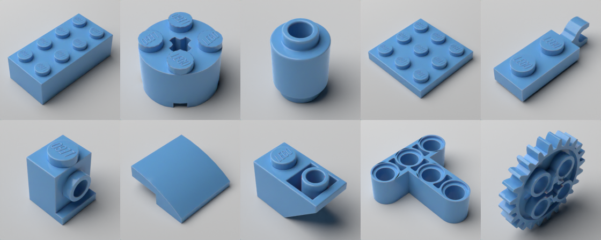

# Lego Rendering Pipeline

Render semi-realistic, individual parts. Primarily used to train
machine learning models for detection, part classification and color
classification.

This uses LDraw's part models and Blender to produce a render.

Renders typically take 15s on an M1 Pro. There is a draft mode
that takes a few seconds.


# Samples

Most LDraw parts can be rendered:



Parts can rotated to various angles. The parts are moved up/down to
remain touching the ground.


Colors: colors can be specified with an RGBA tuple. Also included are a list of named colors from Rebrickable. Only a standard plastic material is supported. Would like to support more materials like transparent and rubber.


Lighting Styles: default, soft, hard


Lighting angle around the part


Camera zoom:


# Setup
- [Blender](https://blender.org)
- [ImportLDraw Plugin](https://github.com/TobyLobster/ImportLDraw)
- [LDraw parts library](https://library.ldraw.org/updates?latest)
  - extract into ./ldraw, e.g. ./ldraw/parts/30010.dat
- Python

```
./setup.sh

 cd /Applications/Blender.app/Contents/Resources/3.5/python/bin
 ./python3-10 -m pip install pillow
```

# Run
```
./run.sh test.py
./run-watch.sh test.py
```

# Run Old

```
./render.sh
```

# Get the dataset onto Paperspace

```
# zip
zip -r myzip.zip renders/dataset renders/dataset.yaml

# upload
aws s3 cp myzip.zip s3://brian-lego-public/myzip.zip

# download
wget https://brian-lego-public.s3.us-west-1.amazonaws.com/myzip.zip -o myzip.zip

unzip lego-2k-images-10classes.zip
mv renders lego-2k-images-10classes
edit the path in dataset.yaml
cd /notebooks
pip install -r requirements.txt
export COMET_API_KEY=...
python train.py
```

# Output format

```
my_dataset.yml
my_dataset/
  train/
    images/
      3001_1.png
      3001_2.png
    labels/
      3001_1.txt
      3001_2.txt
  val/
    images/
      3001_1.png
      3001_2.png
    labels/
      3001_1.txt
      3001_2.txt
```
