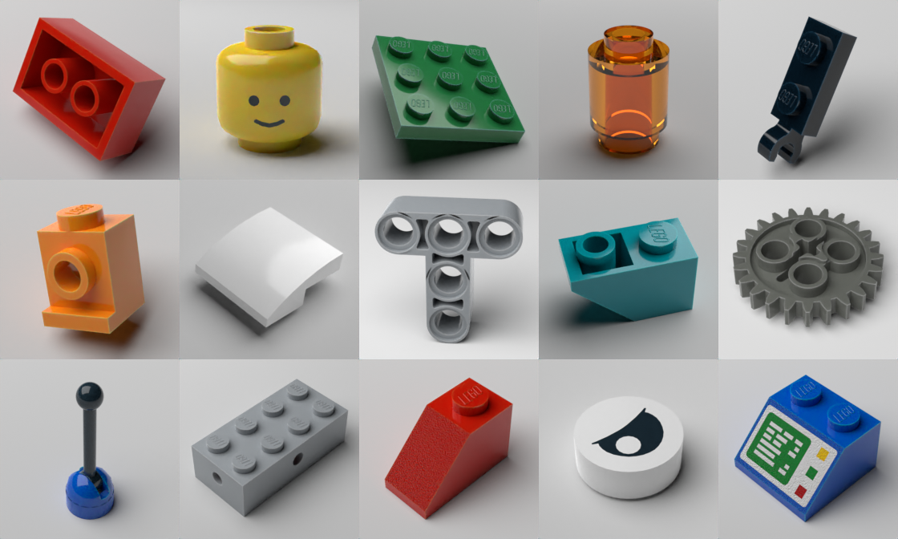
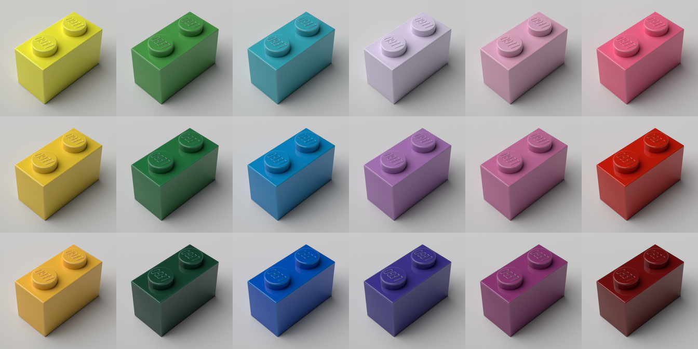
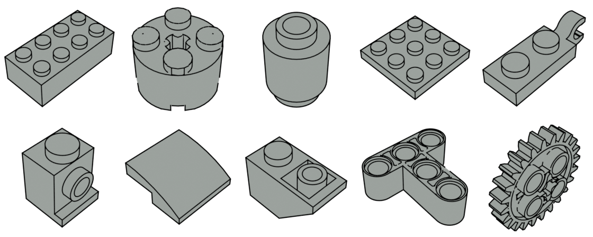

# Lego Rendering Pipeline

Render semi-realistic, individual parts. Primarily used to train
machine learning models for detection, part classification and color
classification.

This uses LDraw's part models and Blender to produce a render.

A single render typically takes 10-15s on an M1 Pro. There is a draft mode
that takes a few seconds.


## Parts

In theory this can render any LDraw part. However I've only tested with typical plastic Lego parts. Parts are specified using their LDraw ID. In many cases this will be same as the mold number on the part but not always. Keep in mind there may be multiple molds over time.


## Materials

Currently supports plastic, transparent and rubber. Not supported yet: pearlescent, glitter, neon colors, metal and cloth.


## Colors

Colors are specified with hex codes in sRGB. Included is a list of named colors from Rebrickable.





## Rotation

Parts can be rotated to various angles. The parts are moved up/down to
remain touching the ground.


## Lighting

Lighting Styles: default, bright, hard


Lighting angle around the part


## Camera

Camera height: degrees from 0-90


Camera zoom


## Instruction Look

By default they are rendered with a transparent background. Use PNG format (`format=Format.PNG`).




## Setup

- Install [Blender](https://blender.org)
- [ImportLDraw Plugin](https://github.com/TobyLobster/ImportLDraw)
  - download the zip into this folder
- [LDraw parts library](https://library.ldraw.org/updates?latest)
  - download and extract to ./ldraw in this folder
- [LDraw unofficial parts](https://library.ldraw.org/tracker)
  - download and extract to ./ldraw in this folder
  - be careful that you add files to ./ldraw/parts instead of replacing the folder
- Your terminal needs Full Disk Access (to install lego_render in Blender.app) :(
- Run
    ```
    ./setup.sh
    ```
- Run Blender -> Edit -> Preferences -> Adds Ons -> Import LDraw -> check it to enable

If you don't want to run setup.sh

- install ImportLDraw into Blender as a normal plugin
- in the Blender python console run using something [like this](https://stackoverflow.com/a/50255019) to install `lego-rendering` package


## Run

Build script:

```python
sys.path.insert(0, site.getusersitepackages())
from lego_rendering import Renderer, RenderOptions, Quality, LightingStyle, Look, Material, RebrickableColors

renderer = Renderer(ldraw_path="./ldraw")

renderer.render_part("6126b", RenderOptions(
    image_filename = "renders/test.jpg",
    part_color = RebrickableColors.Blue.value.best_hex,
    material = Material.PLASTIC,
    lighting_style = LightingStyle.BRIGHT,
    light_angle = 160,
    part_rotation = (0, 0, 270),
    camera_height = 45,
    zoom = 0.1,
    look = Look.NORMAL,
    width = 244,
    height = 244,
))
```

See `lego_renderer/renderer/render_options.py` for the full list of options. See `docs-*.py` to see how the images on this page were genereated.

Run in Blender's Python environment:

```
./run.sh test.py         # renders to renders/test/png

./run-watch.sh test.py   # run test.py each time a .py file is saved
```
