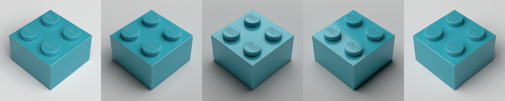

# Lego Rendering Pipeline

Render semi-realistic, individual parts. Primarily used to train
machine learning models for detection, part classification and color
classification.

This uses LDraw's part models and Blender to produce a render.

Renders typically take 15s on an M1 Pro. There is a draft mode
that takes a few seconds.


# Samples

In theory this can render any LDraw part. However I've only tested with typical plastic Lego parts. Parts are specified using their LDraw ID. In many cases this will be same as the mold number on the part (beward multiple molds over time) but not always.


Parts can rotated to various angles. The parts are moved up/down to
remain touching the ground.


Colors: colors can be specified with an RGBA tuple. Also included are a list of named colors from Rebrickable. Only a standard plastic material is supported. Would like to support more materials like transparent and rubber.


Lighting Styles: default, bright, hard


Lighting angle around the part



Camera zoom:


Instruction style:


# Setup
- [Blender](https://blender.org)
- [ImportLDraw Plugin](https://github.com/TobyLobster/ImportLDraw)
- [LDraw parts library](https://library.ldraw.org/updates?latest)
  - download the complete zip
  - extract into ./ldraw, e.g. ./ldraw/parts/30010.dat
- [LDraw unofficial parts](https://library.ldraw.org/tracker)
  - download all Unofficial Files
  - extract into ./ldraw/unofficial, e.g. ./ldraw/unofficial/parts/22388.dat
- Python

```
./setup.sh
```

# Run
```
./run.sh test.py         # renders to renders/test/png

./run-watch.sh test.py   # run test.py each time a .py file is saved
```
